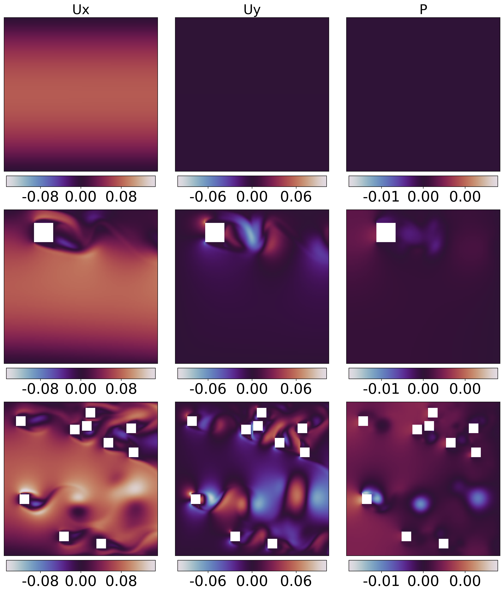
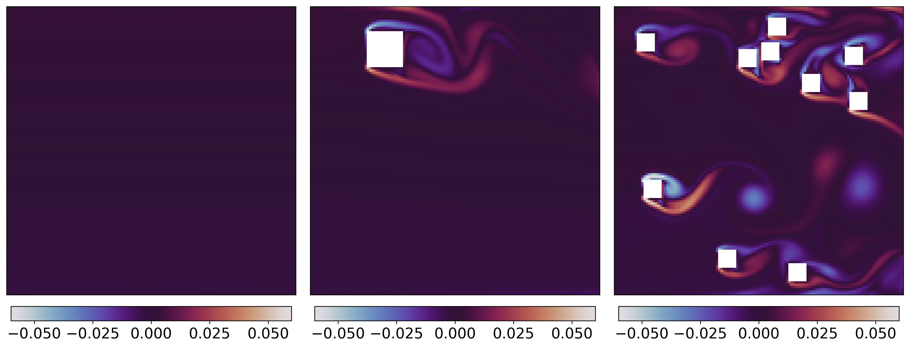

<div align="center">

# Pre-Generating Multi-Difficulty PDE Data For Few-Shot Neural PDE Solvers

[](https://huggingface.co/datasets/sage-lab/PreGen-NavierStokes-2D)
[](https://arxiv.org/abs/2512.00564)
[](https://opensource.org/licenses/MIT)

[Paper](https://arxiv.org/abs/2512.00564) | [Dataset](https://huggingface.co/datasets/sage-lab/PreGen-NavierStokes-2D) | [Website](https://naman-choudhary-ai-ml.github.io/pde-difficulty-transfer/)

Official code repository for the research paper on difficulty transfer in neural PDE solvers.

</div>

**Authors**: Naman Choudhary*, Vedant Singh*, Ameet Talwalkar, Nicholas Matthew Boffi, Mikhail Khodak, Tanya Marwah (* Equal contribution)

**Institution**: Machine Learning Department, Carnegie Mellon University; Department of Computer Sciences, UW-Madison; Simons Foundation

## Dataset

We provide pre-generated datasets for training neural PDE solvers with multi-difficulty data:

- **Hugging Face Dataset**: [PreGen-NavierStokes-2D](https://huggingface.co/datasets/sage-lab/PreGen-NavierStokes-2D)
- **Dataset Type**: Multi-difficulty 2D incompressible Navier-Stokes equations with varying:
  - **Geometry complexity** (number and placement of obstacles)
  - **Physics complexity** (Reynolds numbers)
  - **Combined difficulty variations**

## Example Visualizations

### Physical Channels
Example physical channels from our dataset: velocity components (Ux, Uy), pressure (P), and vorticity fields with geometry mask:

<div align="center">

</div>

### Increasing Complexity
Visualizations showing increasing geometry complexity (left to right) and physics complexity via Reynolds number in Flow Past Object (FPO) simulations:

<div align="center">

</div>

## Overview

This research addresses a key bottleneck in neural PDE solvers: the computational cost of generating training data often exceeds the cost of training the model itself. We demonstrate that by strategically combining low and medium difficulty examples with high-difficulty examples, we can achieve **8.9× computational savings** on dataset pre-generation while maintaining the same error levels.

## Repository Structure

- **CNO_Experiments/**: Experiments with Convolutional Neural Operators (CNO)
  - Training scripts for different difficulty levels
  - Fine-tuning and evaluation scripts
- **dataset_gen/**: Dataset generation utilities for creating multi-difficulty PDE data
- **Poseidon_mixing_Exp/**: Experiments with Poseidon-based mixing approaches
- **requirements.txt**: All project dependencies

## Installation

```bash
git clone https://github.com/Naman-Choudhary-AI-ML/pregenerating-pde.git
cd pregenerating-pde
pip install -r requirements.txt
```

## Quick Start

### Training a Model

```bash
cd CNO_Experiments
python TrainCNO_time_L.py  # Train on low difficulty data
```

### Testing

```bash
python TestCNO_ALL.py
```

## Key Findings

- **Difficulty Transfer**: Low and medium difficulty data transfers effectively to high-difficulty problems
- **8.9× Compute Savings**: Combining multi-difficulty data reduces classical solver compute by ~8.9× while maintaining error rates
- **Practical Impact**: Enables training on harder problems with significantly reduced computational overhead

## Citation

If you find this work or the dataset useful, please cite our paper:

```bibtex
@article{choudhary2025pregenerating,
  title={Pre-Generating Multi-Difficulty PDE Data for Few-Shot Neural PDE Solvers},
  author={Choudhary, Naman and Singh, Vedant and Talwalkar, Ameet and Boffi, Nicholas Matthew and Khodak, Mikhail and Marwah, Tanya},
  journal={arXiv preprint arXiv:2512.00564},
  year={2025},
  eprint={2512.00564},
  archivePrefix={arXiv},
  primaryClass={cs.LG},
  url={[https://arxiv.org/abs/2512.00564](https://arxiv.org/abs/2512.00564)}
}
```

## Project Website

For more details and visualizations: [https://naman-choudhary-ai-ml.github.io/pde-difficulty-transfer/](https://naman-choudhary-ai-ml.github.io/pde-difficulty-transfer/)

## Contact

- Naman Choudhary: [namanchoudharyimp@gmail.com](mailto:namanchoudharyimp@gmail.com)
- Vedant Singh: [vhsingh@andrew.cmu.edu](mailto:vhsingh@andrew.cmu.edu)
